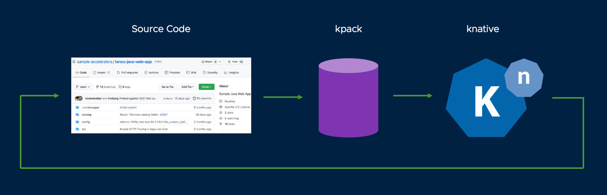

# Install Cartographer

Run the installer script from the root directory of this repo:

Mac/Linux:
```
./install-cartographer.sh
```

Windows:
```
.\install-cartographer.ps1
```

For this workshop, we set up a simple supply chain for your application. Cartographer will monitor the git repo that you specify. Commits to the repo will trigger a container build of your source code using kpack. When kpack has built and published the container image, knative will pick up create a running deployment of your application inside your Kubernetes cluster, and provide a URL for you to access the application.



[Back to Homepage](../README.md)