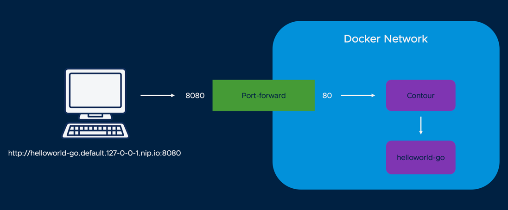

# Install Knative

Run the installer script from the root directory of this repo:

Mac/Linux:
```
./install-knative.sh
```

Windows:
```
.\install-knative.ps1
```

This script will install Contour as our ingress controller, and Knative as a serverless runtime. 

For a personal computer install, we set Contour to use a ClusterIP endpoint because there will not be a LoadBalancer available. Whenever you want to access applications using Contour ingress, you will need a port forward to send localhost traffic to envoy. 

Execute the following command in a separate terminal session or tab, and leave it running:

```
kubectl port-forward svc/envoy 8080:80 -n projectcontour
```

To simplify DNS, we set our Knative DNS Domain to 127-0-0-1.nip.io. This will automatically route requests to localhost, where your port forward will send them to Contour:

### Validating the install

You can verify everything works so far by creating a Knative service:

```
kn service create helloworld-go --image gcr.io/knative-samples/helloworld-go
```

When the service is available, you should be able to access it in your browser through the port-forward: http://helloworld-go.default.127-0-0-1.nip.io:8080



As long as the port-forward is running, requests to your browser will find their way to the ingress controller on your cluster, which in turn will forward them to your application.

[Back to Homepage](../README.md)